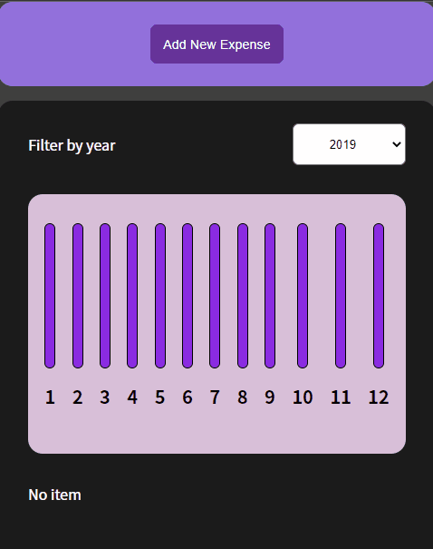

# app



# 주요 기능

## 1. toggle

```js
const [toggle, setToggle] = useState(false);
const toggleHandler = () => {
  setToggle((prev) => !prev);
};
```

- toggle이 false일 때에는 button을, true일 때는 form을 보여주기 위해 useState를 사용했다.
- cancel과 add button을 따로 만들어서 사용하지 않고, 같은 컴포넌트로 재사용하였다.

## 2.filter by year

```js
// filter.jsx
const filterChangeHandler = (e) => {
  props.setFilterYear(e.target.value);
};

// expenses.jsx
const [filterYear, setFilterYear] = useState('2022');
const filterd = props.expenses.filter(
  (item) => item.date.getFullYear().toString() === filterYear
);
```

- 사용자가 선택한 연도에 따라 expenses 목록을 새로 렌더링하기 위해 state를 끌어올렸다.
- filter 함수를 이용해서 전체 데이터 중 해당하는 연도의 데이터만을 추출해서 새로운 배열로 반환하였다.

## 3. input initialization

```js
const [titleInput, setTitleInput] = useState('');
const [amountInput, setAmountInput] = useState('');
const [dateInput, setDateInput] = useState('');

const submitHandler = (e) => {
  e.preventDefault();

  const newExpenseData = {
    title: titleInput,
    amount: amountInput,
    date: new Date(dateInput),
  };
  props.saveData(newExpenseData);

  setTitleInput('');
  setDateInput('');
  setAmountInput('');
};
```

- form이 제출되었을 때 사용자가 input에 입력했던 모든 값들이 초기화되어 화면에 보여지도록, input value를 state로 관리했다.

## 4. add new expense

```js
// newExpenseForm.jsx
const saveDataHandler = (data) => {
  const newData = {
    id: Math.random().toString(),
    ...data,
  };
  props.addData(newData);
};

// app.js
const [expenses, setExpenses] = useState(SEED_DATA);
const addDataHandler = (data) => {
  setExpenses((prevState) => [data, ...prevState]);
};
```

- 모든 expense가 list item 형식으로 렌더링되기 때문에, 이를 최적화하기 위해 id property를 추가하였다.
- data가 추가되더라도, 기존의 data를 잃어버리지 않기 위해 prevState와 spread operator를 이용해서 state를 업데이트하였다.

# 개선할 점 & 느낀점

- 사용자가 form을 제출할 때 선택된 날짜의 연도에 맞게, expenses 목록을 렌더링한다.
- 커밋 메세지 정하기가 어려운 것 같다. 컴포넌트 단위로 커밋을 하고는 있는데 잘 하고 있는 건지 모르겠다. ╚(•⌂•)╝
